# Lab5_Javascript
## Belajar HTML JavaScript

### Pengenalan JavaScript
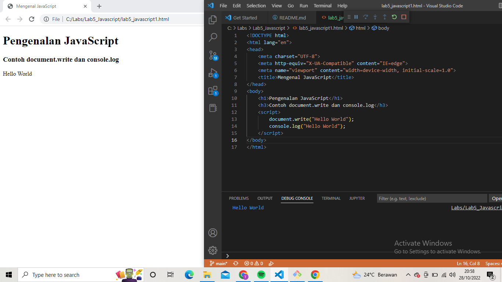

### Pemakaian Alert sebagai property window
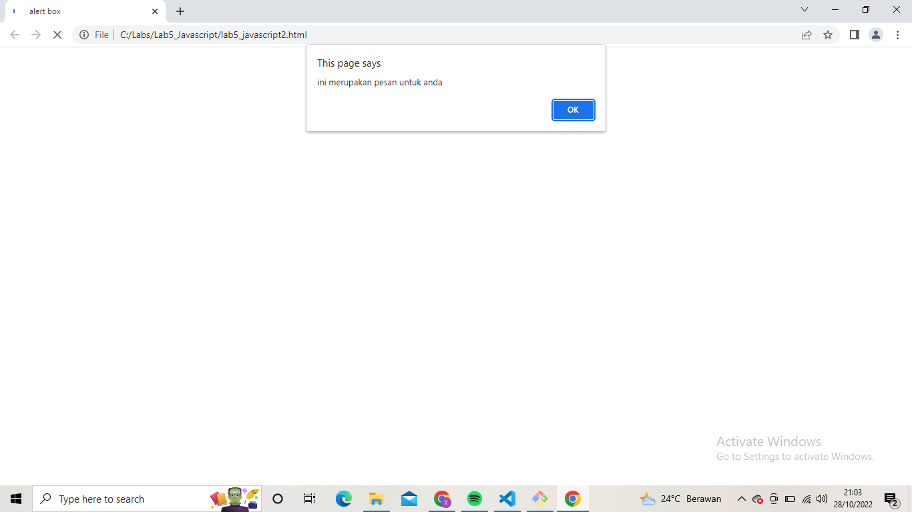

### Pemakaian method dalam objek
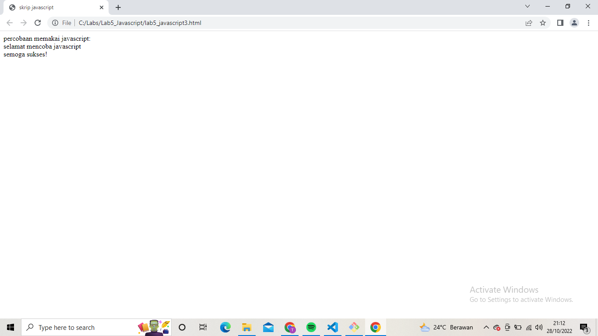

### Pemakaian Prompt
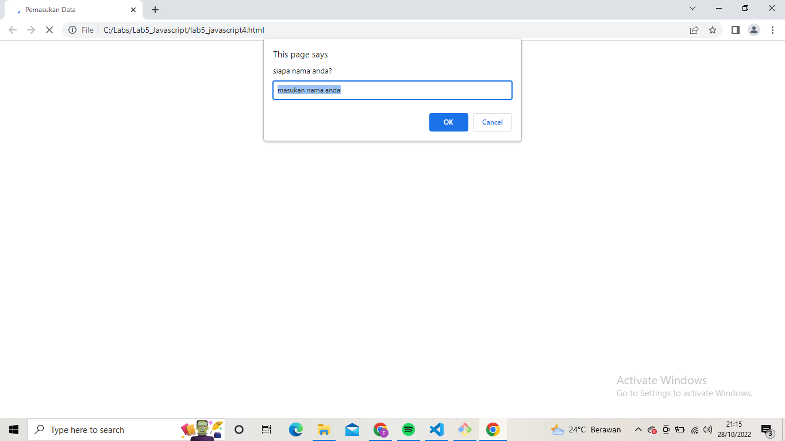
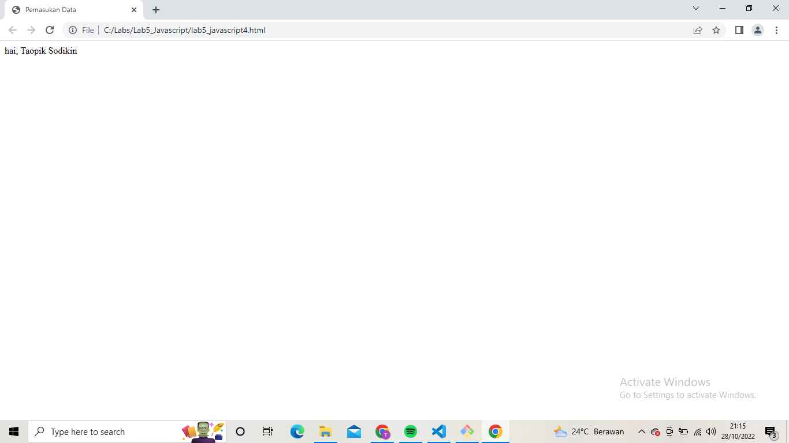

### Pembuatan fungsi dan cara pemanggilannya

### Operasi dasar aritmatika
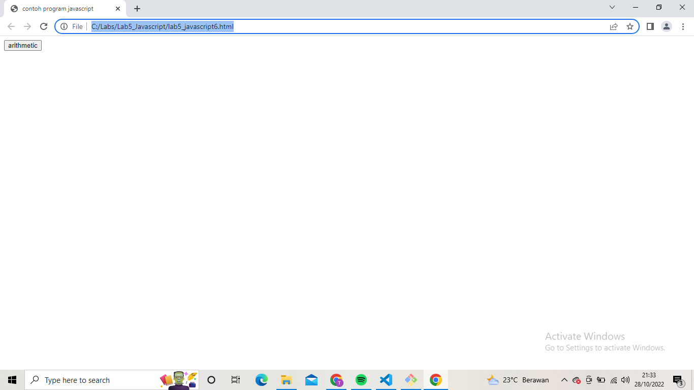
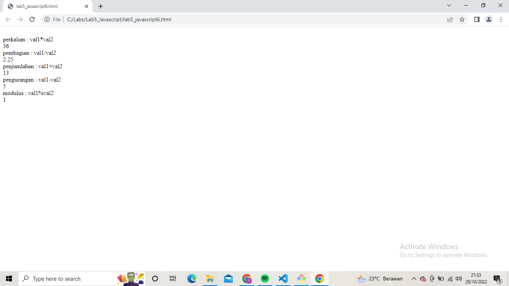

### Seleksi kondisi (if-else)
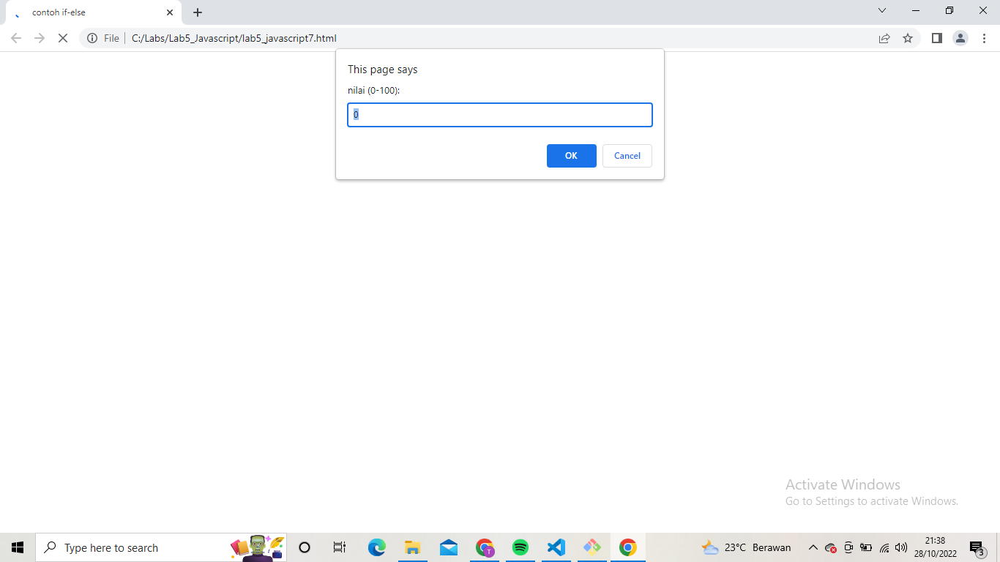

### Penggunaan operator switch untuk seleksi kondisi
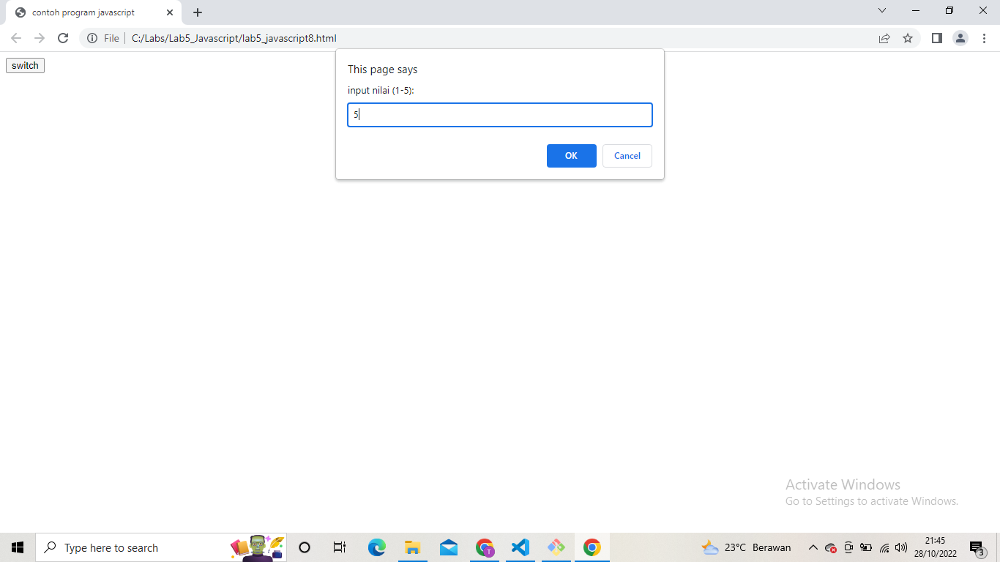

### Form Input
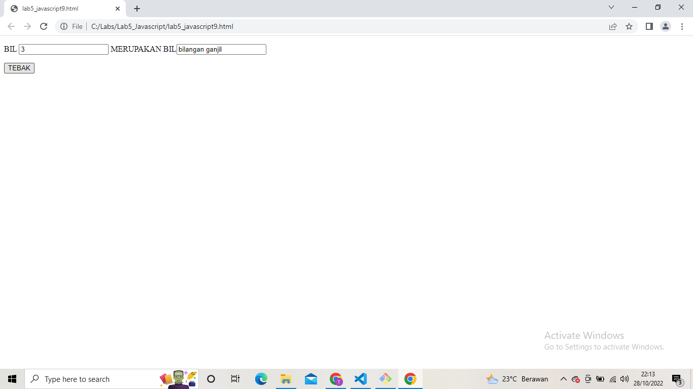

### Form Button
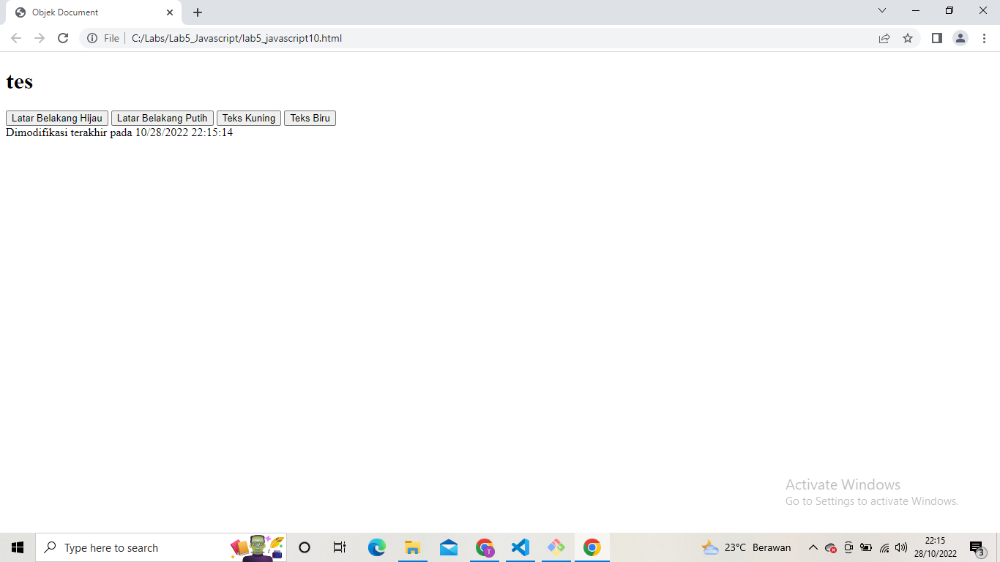
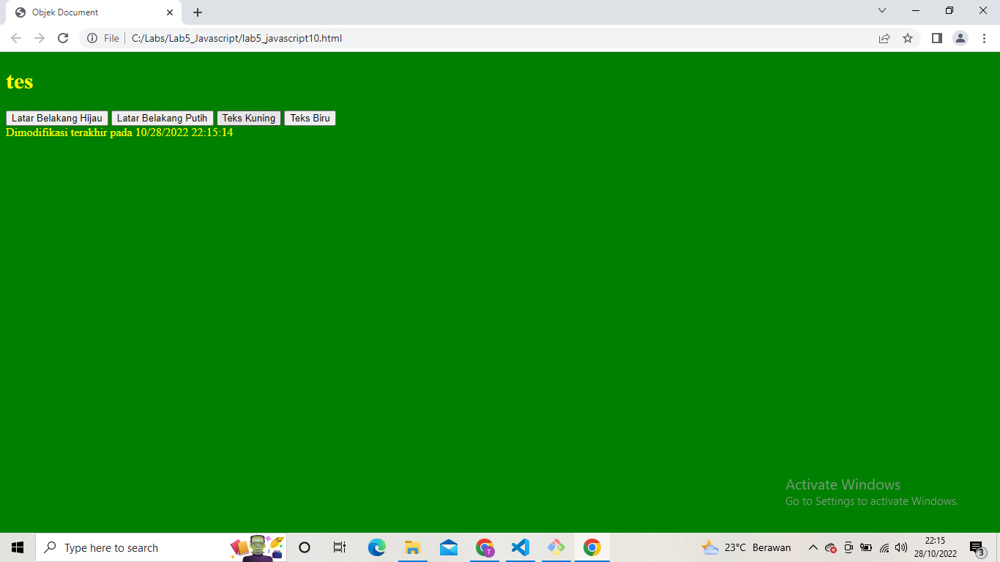

### Pilihan menggunakan checkBox dengan perhitungan otomatis
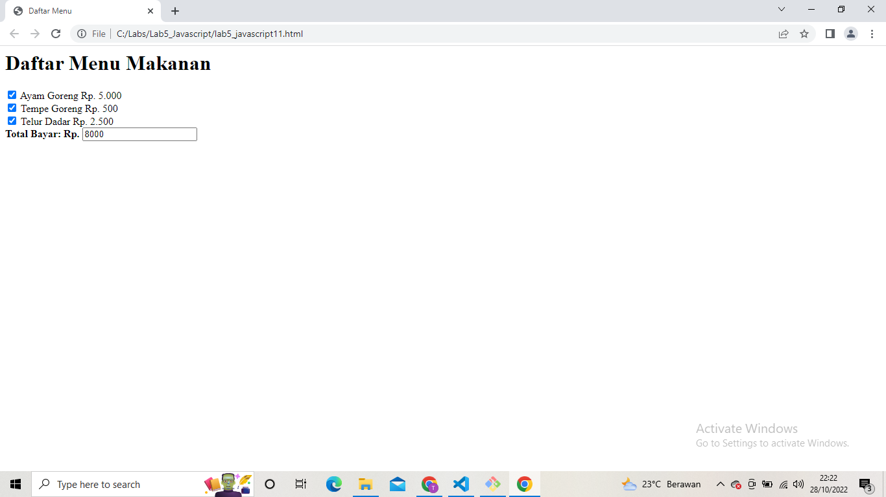

### Validasi Form
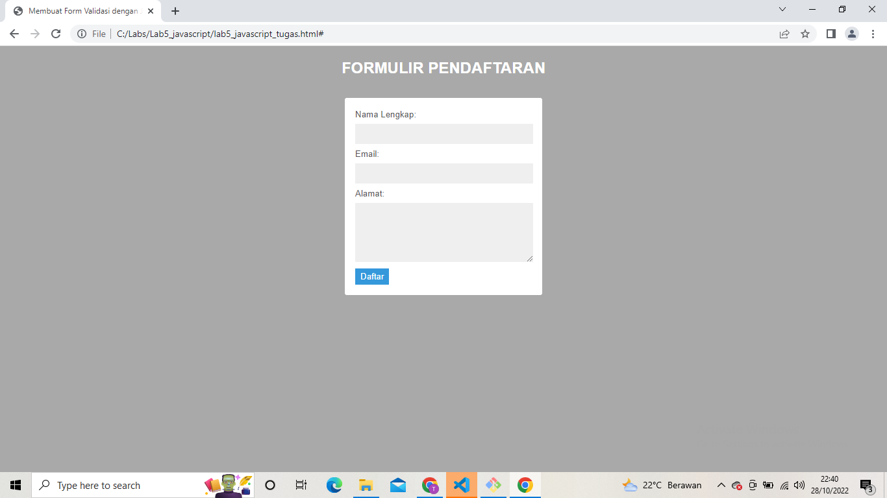
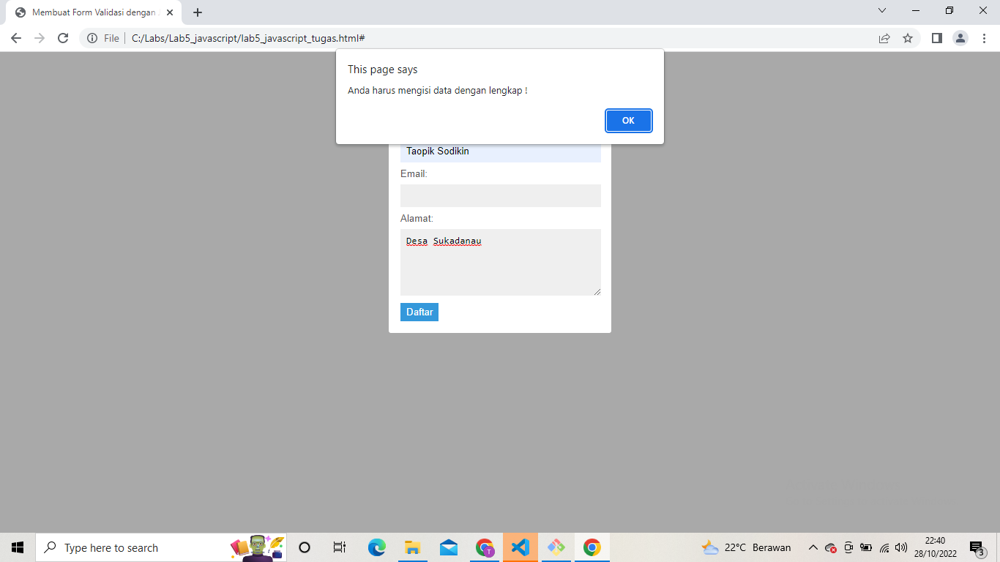