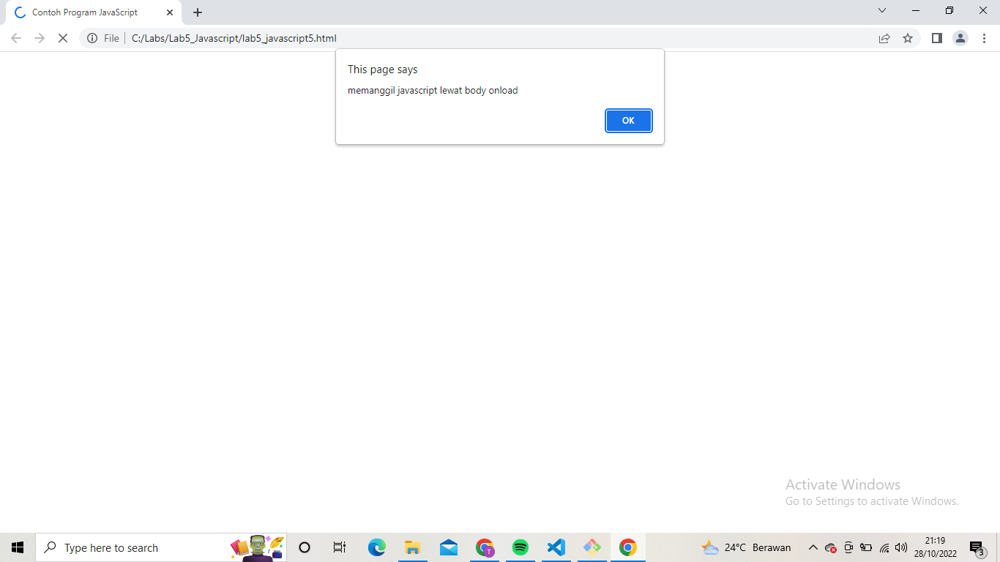
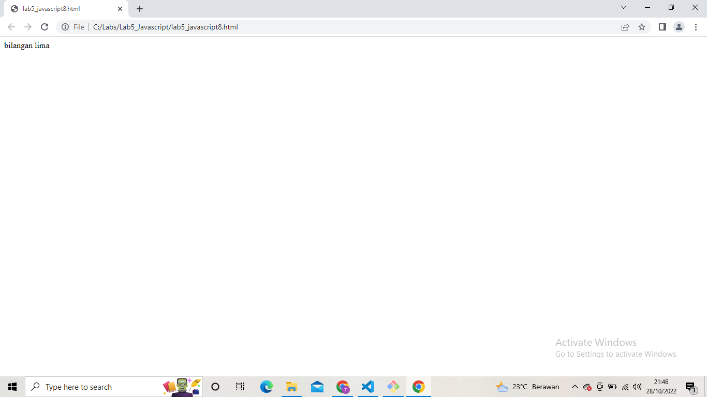

# Lab5_Javascript
## Belajar HTML JavaScript

### Pengenalan JavaScript

### Pemakaian Alert sebagai property window

### Pemakaian method dalam objek

### Pemakaian Prompt

### Pembuatan fungsi dan cara pemanggilannya

### Operasi dasar aritmatika

### Seleksi kondisi (if-else)

### Penggunaan operator switch untuk seleksi kondisi

### Form Input

### Form Button

### Pilihan menggunakan checkBox dengan perhitungan otomatis

### Validasi Form

